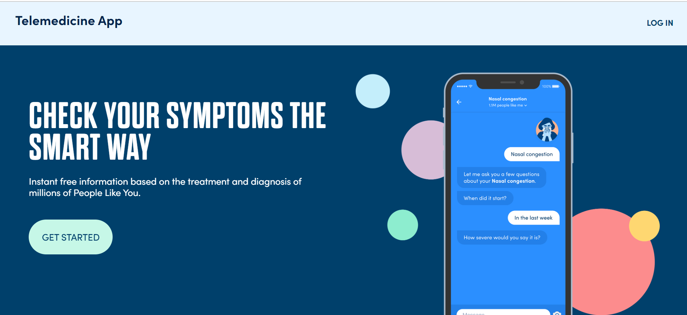
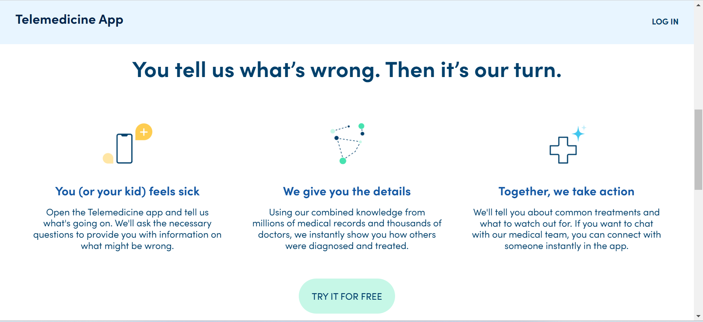
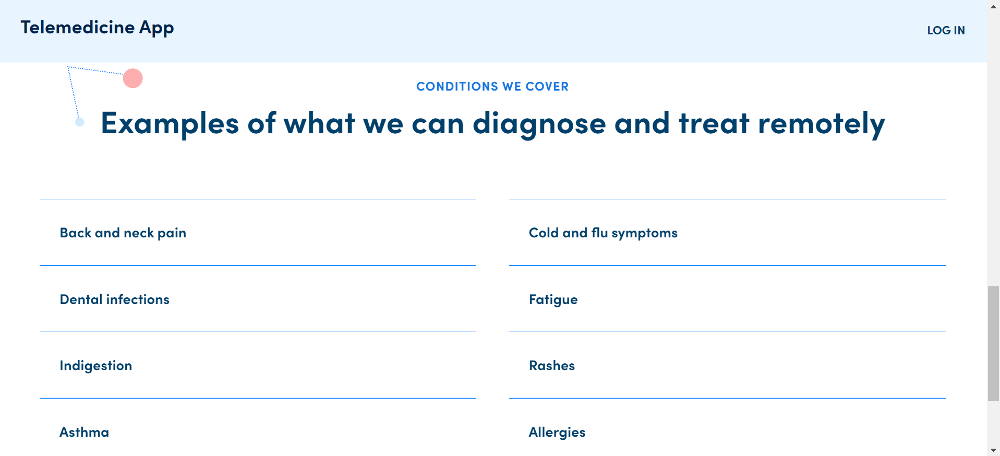
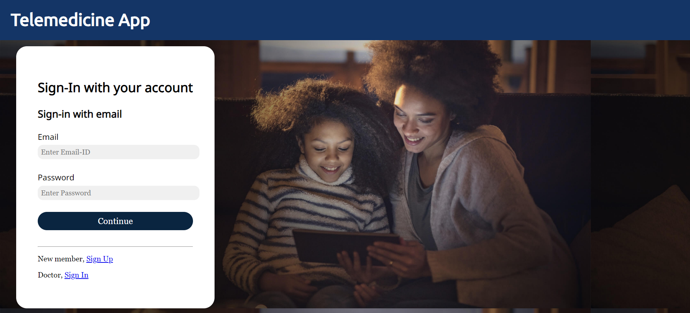
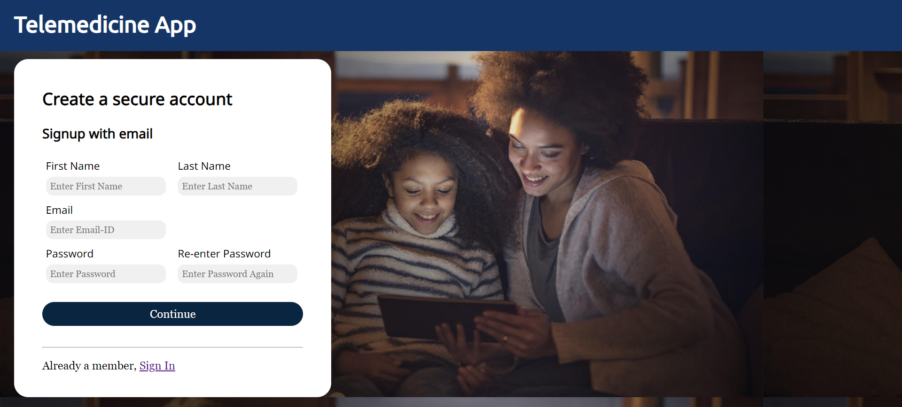
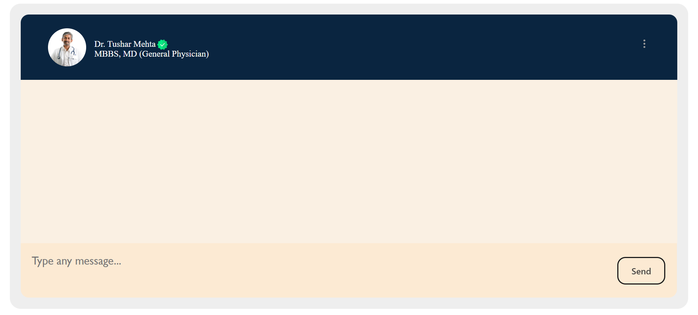
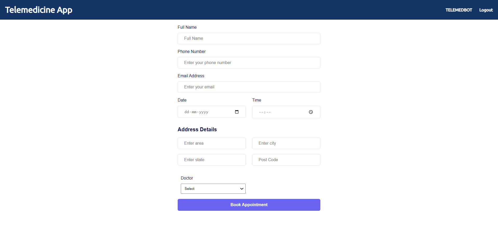

# Telemedicine App
Telemedicine App is an application which helps people to connect with online doctors and books the appointment for check-up. Also It provides a Doctor Chatbot which suggest and provides solution to the problem of the patient instantaneously. Patient and Doctor can be verified on platform using Login/Signup feature.
## Technologies Used
Java, JakartaEE, JSP, MySQL, Apache Tomcat, HTML, CSS, JavaScript, AJAX, APIs.
 
### Some Screenshots:

